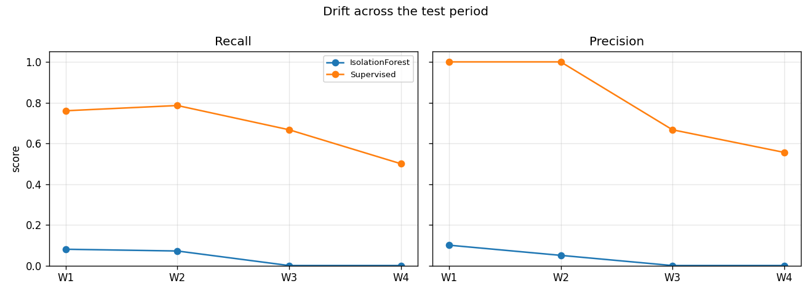
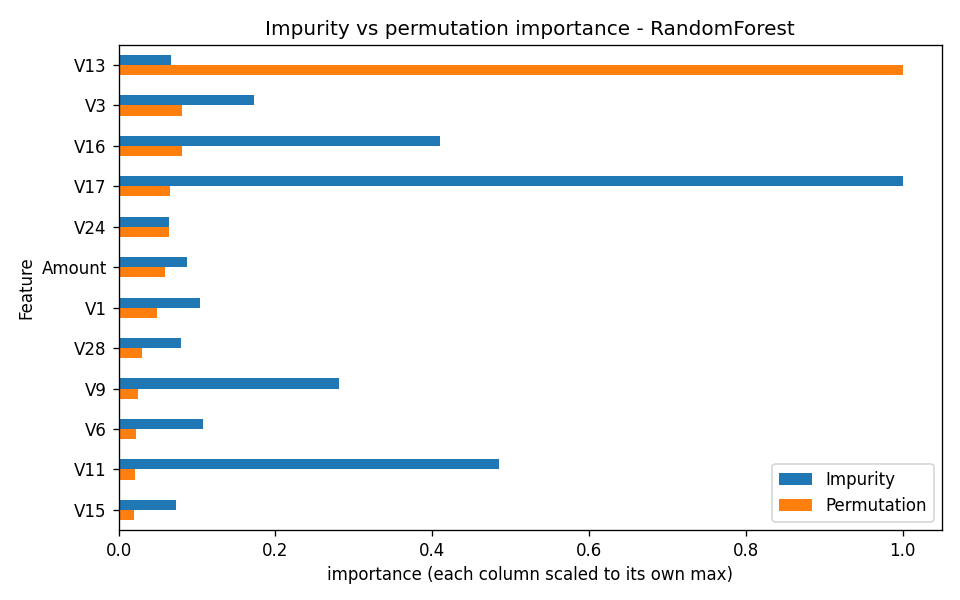

# 💳 Credit Card Fraud Detection — Assignment 1

This project finds fraud in credit card payments.
Fraud is very rare: only about **2 in every 1,000** payments are fraud. That makes it hard to catch.

We use the **ULB Credit Card Fraud** dataset from Kaggle (about 285,000 payments).
The code downloads it for you.

---

## 🧩 The 7 tasks

1. **📊 Look at the data and clean it**
   Check the data, remove repeated rows, and split it into train, validation and test parts.
   We also list every way test data could "leak" into training, and how we stop it.

2. **🤖 Train models**
   Train 6 models (Decision Tree, k-NN, Naive Bayes, Logistic Regression, Random Forest, LightGBM)
   plus a simple "always says not fraud" baseline. Then try 5 ways to handle the rare fraud class.

3. **📏 Measure them the right way**
   Accuracy is not useful here (a model can be 99.8% "accurate" and catch zero fraud).
   So we use better scores, draw curves, pick the cheapest decision threshold, and test if the top two models are really different.

4. **🔍 Find fraud without labels**
   Use anomaly detectors (Isolation Forest, LOF, One-Class SVM) that spot "strange" payments.
   We also check how many labels a normal model needs before it beats them.

5. **⏳ Check changes over time**
   Train on older payments, test on newer ones, and see if the models get worse over time.
   We also suggest how to watch and retrain the system.

6. **💡 Explain the decisions**
   Show which features matter most, and use SHAP to explain single payments in plain words.

7. **✅ Give a recommendation**
   Collect the key numbers and suggest what kind of fraud system a bank should use.

---

## 🏆 Main results

All numbers come from our full run on Google Colab. The test set has only 71 frauds, so small differences can be luck.

**1️⃣ Which model is best?** (validation set; F1 is a score that mixes "how many alarms are real" with "how many frauds we caught")

| Model | PR-AUC | F1 |
|---|---|---|
| 🥇 Random Forest | 0.823 | 0.875 |
| LightGBM | 0.802 | 0.829 |
| k-NN | 0.798 | 0.823 |
| Decision Tree | 0.726 | 0.715 |
| Logistic Regression | 0.693 | 0.625 |
| Naive Bayes | 0.077 | 0.108 |
| "Always not fraud" baseline | 0.002 | 0.000 |

**2️⃣ Does fixing the imbalance help?** (F1 score, higher is better)

| Strategy | Random Forest | LightGBM |
|---|---|---|
| Do nothing | 0.875 | 0.359 |
| Class weights | 0.817 | 0.815 |
| Random undersampling | 0.089 | 0.072 |
| SMOTE | 0.835 | 0.712 |
| Move the threshold | 0.875 | 0.447 |

Undersampling is the clear loser: it catches many frauds but raises over 1,000 false alarms.
(LightGBM's "do nothing" row is low because this experiment uses default settings, not the tuned ones.)

**3️⃣ Do we need fraud labels?** (test set, PR-AUC)

| Method | PR-AUC |
|---|---|
| Random Forest (all labels) | 0.782 |
| LOF, trained on normal payments only | 0.548 |
| LOF, no labels | 0.175 |
| One-Class SVM, trained on normal payments only | 0.171 |
| Isolation Forest, no labels | 0.155 |

Labels win clearly. A Random Forest trained on just **1%** of the labels (only 3 frauds) already scores 0.63, better than every detector above.

### 📈 Two figures



*The Random Forest catches fewer frauds in later time windows (recall falls from about 0.76 to 0.50), while Isolation Forest finds almost none.*



*The two ways of measuring importance disagree: the forest's own count favours V17, but shuffling the data shows V13 matters most.*

---

## ▶️ How to run

```bash
pip install -r requirements.txt
python main.py
```

- 🖥️ The full run is slow. **Google Colab** is a good place to run it.
- ⚡ For a quick test, set `SAMPLE_FRACTION = 0.05` in `config.py` (uses only 5% of the data).
- 👀 While it runs, the console shows what step it is on, how long it has taken, and a time estimate.

## 📁 What you get

- `figures/` 🖼️ all the charts
- `tables/` 📋 all the result tables (CSV files)

## 🗂️ Main files

| File | What it does |
|---|---|
| `main.py` | Runs all 7 tasks |
| `config.py` | All settings in one place |
| `task1_1_...py` to `task1_7_...py` | One file per task |
| `models.py` | The models and their settings |
| `progress.py` | Shows progress in the console |
| `utils.py` | Small shared helpers |
